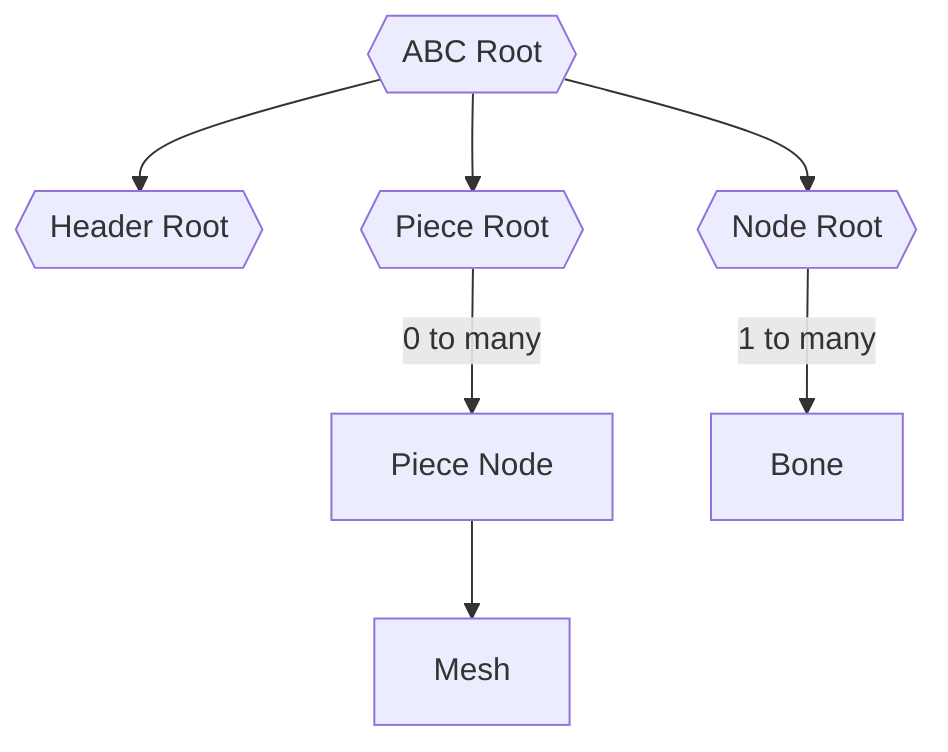

# Lithtech ABC Format

This importer supports [LithTech](https://en.wikipedia.org/wiki/LithTech) 2.x ABC files from version 9 throughout 
version 13.

## Layout

The format is loaded into nodes structured like:

The `Header Root` node contains metadata for the ABC `version`, `command_strings`, and `internal_radius`.

Each `Piece Node` references an `aiMesh` which:

* Contains vertex, face, and bone weight data.
* References slim material representing the material index from the 
piece chunk, and the `$mat.ltabc.specularpower`, and `$mat.ltabc.specularscale` as material properties.
* Contain metadata for `lod_index` and `lod_distance`.
* Contains the full list of `aiBone` resources. You can determine which aiBone is used by looping through and checking
`mNumWeights > 0`.

Materials do not contain a reference to the diffuse textures used, as that information is stored separately from the
ABC file. For example/ in No One Lives Forever throughout the attribute files. For props they're located in 
`Attributes/Proptypes.txt` and characters are built from `MeshName_Style_(Head|BodyPartExtension|Cinematic).dtx`.

This makes it fairly impractical to guess which texture we should load for the mesh. 

## Quirks

When exporting as another format material information may be lost.